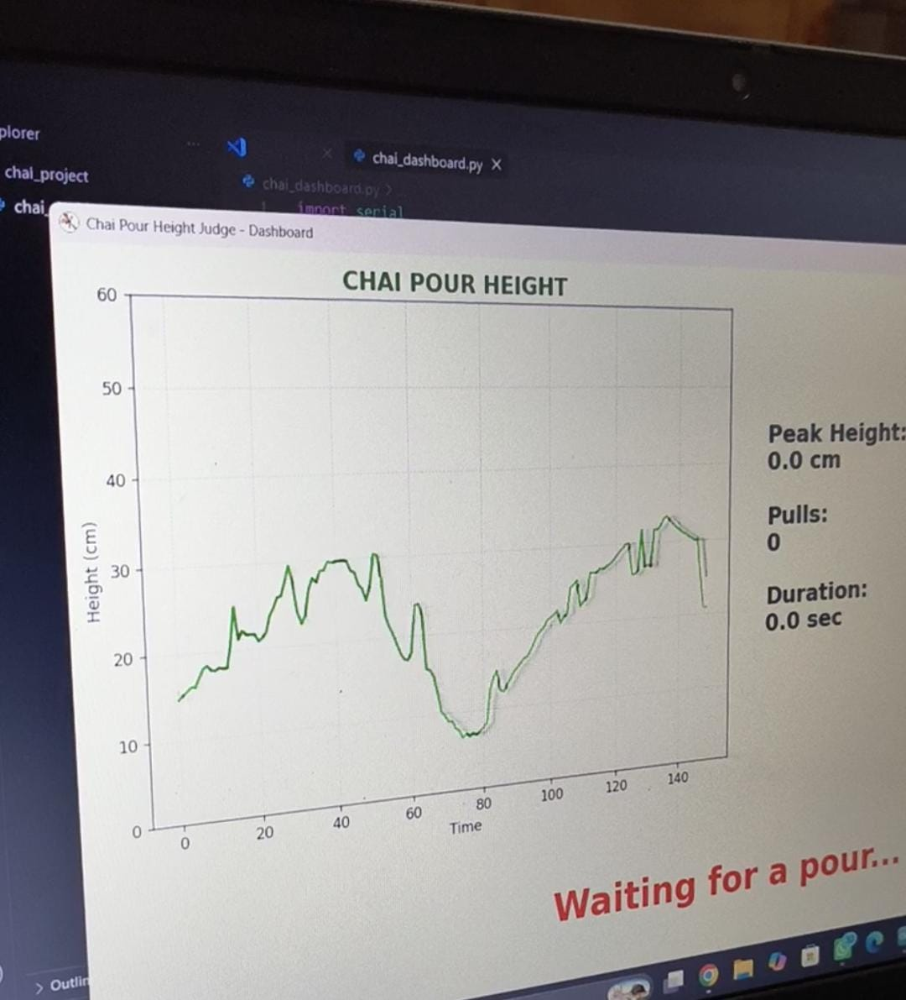
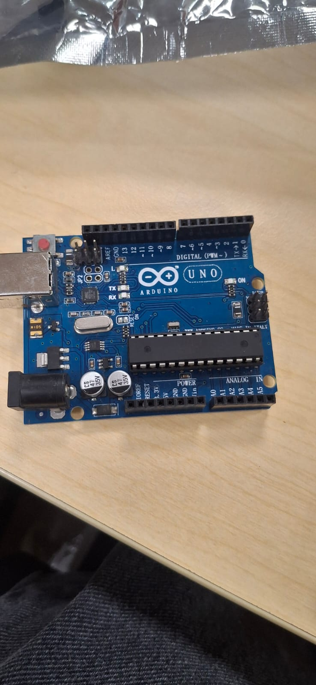
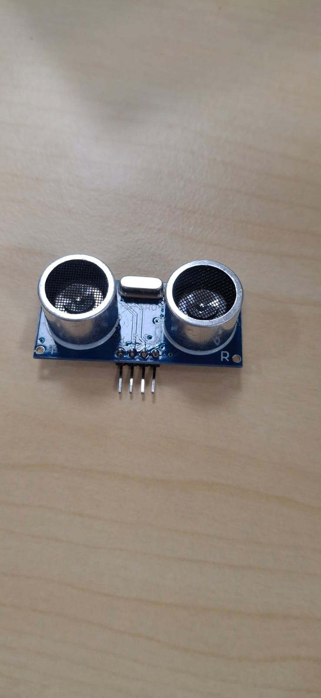

o# ☕ Chai-ography 🎯
### *Measuring the art of the pour.*

## Basic Details

**Team Name:** Pour-Overs

### Team Members

- **Team Lead:** Wazha afzal Koyappathodi - College of Engineering Chengannur
- **Member 2:** Shifa K p - College Of Engineering Chengannur

---

## Project Description

**Chai-ography** is a low-cost, non-contact motion-sensing device that measures and analyzes the style of pouring tea. It uses an ultrasonic distance sensor and Arduino to measure the pourer's height, pull count, and duration, and displays the result live on a laptop dashboard with a fun pouring character.

---

## The Problem (that doesn't exist)

> **"Who pours chai with more style — you or the thattukada chettan?"** 😎

Pouring tea is something we do all the time, but nobody actually measures how dramatically or stylishly someone pours it.

The height, rhythm, and duration of a pour disappear the moment the tea reaches the cup.

So we decided to solve this extremely important problem that absolutely nobody asked us to solve. 😂

---

## The Solution (that nobody asked for)

We built **Chai-ography**, a non-contact tea-pouring judge.

An ultrasonic sensor detects the movement of the pourer's hand or kettle and measures:

- 📏 Peak pouring height
- 🔄 Number of pouring pulls
- ⏱️ Pouring duration
- 🎭 Overall pouring character

The measurements are processed using simple rule-based logic and displayed on a live Python dashboard along with a wavy graph representing the pouring motion.

At the end, the pourer receives a fun character/sticker based on their pouring style.

---

# 🔧 Technical Details

## Technologies / Components Used

### 💻 For Software

- **Languages:** Python, Arduino C/C++
- **Libraries:** PySerial, Matplotlib
- **Tools:** Arduino IDE, Visual Studio Code, GitHub

### 🔌 For Hardware

- Arduino
- HC-SR04 Ultrasonic Distance Sensor
- Jumper wires
- USB cable
- Laptop
- Tea cup / marked pouring area

### 📡 Sensor

**HC-SR04 Ultrasonic Distance Sensor**

The sensor measures the distance between the sensor and the moving hand/kettle without physical contact.

---

# ⚙️ Implementation

The Arduino continuously measures distance using the HC-SR04 sensor.

During a pour, the system tracks:

1. **Peak Height** – maximum distance reached during the pour.
2. **Pull Count** – number of deliberate up-and-down movements.
3. **Duration** – total duration of the pouring action.

These values are sent through the serial port to the Python dashboard.

The Python program receives the data, plots the live pouring movement, displays the statistics, and shows the corresponding pouring character/sticker.

---

# 📥 Installation

## Arduino

1. Open the Arduino code in **Arduino IDE**.
2. Connect the HC-SR04 sensor to the Arduino.
3. Upload the program to the Arduino.

## Python

Install the required libraries:

```bash
pip install pyserial matplotlib
```

## Project Folder

Keep the Python program and sticker folder together:

```text
Chai-ography/
│
├── chai_dashboard.py
│
└── stickers/
    ├── shy.png
    ├── steady.png
    ├── thattukada.png
    ├── drama.png
    ├── circus.png
    └── normal.png
```

---

# ▶️ Run

1. Connect the Arduino to the laptop.
2. Check the Arduino COM port.
3. Update the port in the Python code if required:

```python
SERIAL_PORT = "COM5"
```

4. Run the Python program:

```bash
python chai_dashboard.py
```

The live dashboard will open and display the pouring height graph, statistics, and final character/sticker.

---

# 📊 Project Documentation

## For Software

### Screenshots

### 1. Live Pouring Graph



**Caption:** Live graph showing the change in pouring height during the tea-pouring action.

### 2. Statistics Dashboard


**Caption:** Dashboard displaying peak height, number of pulls, and pouring duration.

### 3. Pouring Character


**Caption:** Final pouring character/sticker generated based on the measured pouring style.

---

# 🔄 Workflow

```text
Pouring Action
      ↓
HC-SR04 Ultrasonic Sensor
      ↓
Arduino
      ↓
Distance Measurement
      ↓
Peak Height + Pull Count + Duration
      ↓
Serial Communication
      ↓
Python Dashboard
      ↓
Live Graph + Statistics
      ↓
Pouring Character / Sticker
```

**Caption:** Overall workflow of the Chai-ography system from sensing the pouring motion to displaying the final result.

---

# 🔌 For Hardware

## Schematic & Circuit

### Circuit


**Caption:** Connection between the HC-SR04 ultrasonic sensor and Arduino.

### Connections

| HC-SR04 | Arduino |
|---|---|
| VCC | 5V |
| GND | GND |
| TRIG | Digital Pin 7 |
| ECHO | Digital Pin 8 |

### Schematic


**Caption:** Hardware schematic showing the sensor-to-Arduino connections.

---

# 🛠️ Build Photos

## Components




**Components shown:** Arduino, HC-SR04 ultrasonic sensor, jumper wires, USB cable, and tea-pouring setup.

## Build Process


**Description:** The ultrasonic sensor is positioned at a fixed location above the marked pouring area and connected to the Arduino. The Arduino is then connected to a laptop running the Python dashboard.

## Final Product


**Description:** Completed Chai-ography setup ready for a live tea-pouring demonstration.

---

# 🎥 Project Demo

## Video

**Demo Video:** [Add your demo video link here]

The video demonstrates the complete working of Chai-ography, including ultrasonic sensing, live height measurement, pull detection, statistics, and the final pouring character/sticker.

## Additional Demos

[Add any additional demonstration videos, screenshots, or links here.]

---

# 👥 Team Contributions

### [Team Member 1]

- Arduino programming
- HC-SR04 sensor interfacing
- Pull detection logic
- Hardware setup

### [Team Member 2]

- Python dashboard development
- Serial communication
- Live graph implementation
- Data visualization

### [Team Member 3]

- Project documentation
- Testing and calibration
- UI/sticker design
- Demo setup and presentation

---

# 💡 Innovation & Uniqueness

- **Non-contact sensing:** The sensor measures the pouring motion without touching the cup, liquid, or person.
- **Multi-signal analysis:** The system considers height, pull count, and duration instead of using only one measurement.
- **Real-time results:** The result is generated within seconds of completing the pour.
- **Interactive:** Users can try the system and receive their own pouring character.
- **Scalable concept:** The same motion and height-sensing approach could be extended to automated liquid dispensing, gesture-based interfaces, and consistency monitoring.

---

# 🏁 Conclusion

**Chai-ography** turns an ordinary tea-pouring action into a measurable and interactive experience.

By combining a low-cost ultrasonic sensor, Arduino, and a Python-based dashboard, the system captures pouring motion in real time and converts it into understandable measurements and a fun pouring personality.

What started as a ridiculous question — **"Who pours chai with more style?"** — became a working engineering prototype. ☕🔥
